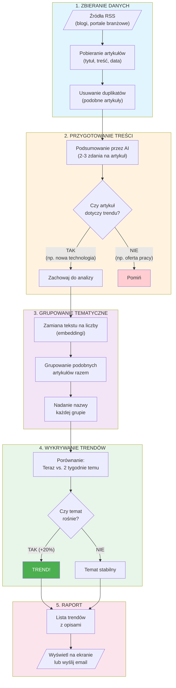

# Jak działa AI Trends Monitor?

## Pełny proces od pobrania artykułów do wykrycia trendów

## Wyjaśnienie prostym językiem

| Etap | Co się dzieje? | Po co? |
|------|----------------|--------|
| 1 | System pobiera artykuły z blogów i portali | Zbieramy dane do analizy |
| 2 | AI czyta każdy artykuł i pisze krótkie streszczenie | Krótsze teksty = lepsza analiza |
| 3 | Podobne artykuły trafiają do jednej grupy | Znajdujemy wspólne tematy |
| 4 | Sprawdzamy które tematy rosną | Wykrywamy co jest "na fali" |
| 5 | Generujemy raport z trendami | Wiemy co jest ważne w branży |
