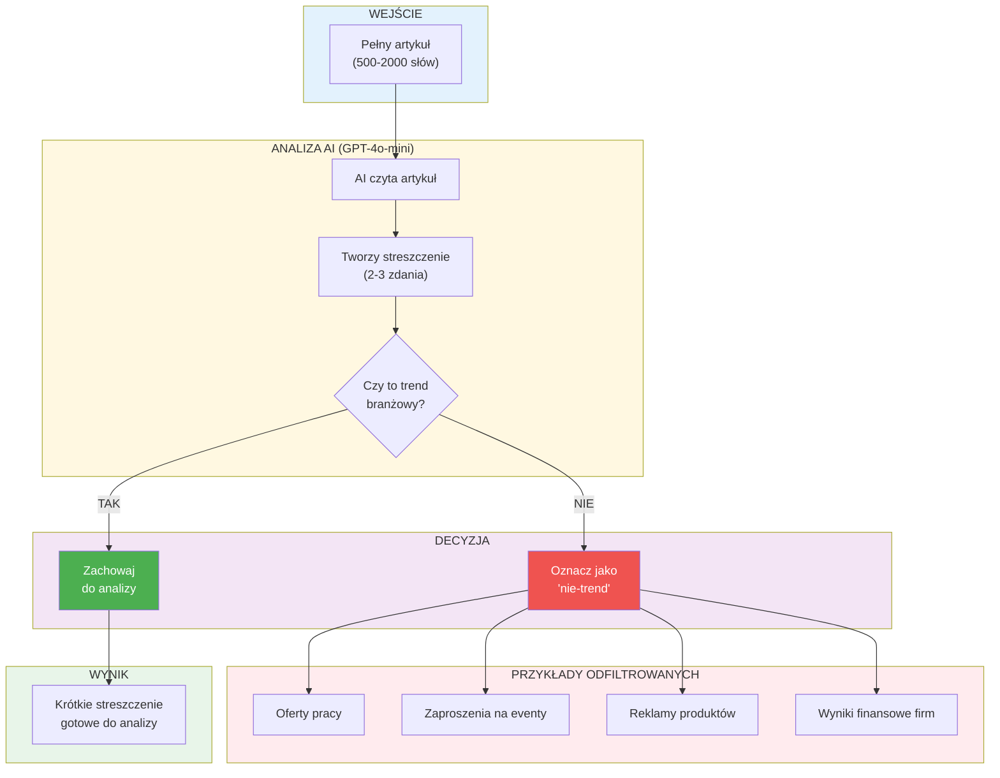
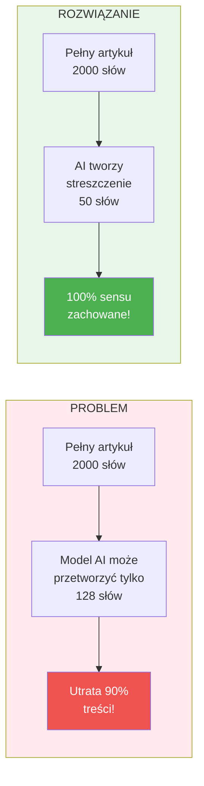

# Jak AI podsumowuje artykuły?

## Proces tworzenia streszczeń

## Dlaczego to ważne?

## Co AI odrzuca jako "nie-trend"?

| Typ treści | Dlaczego odrzucamy? | Przykład |
|------------|---------------------|----------|
| Oferty pracy | To nie trend, to rekrutacja | "Szukamy Marketing Managera" |
| Eventy | Jednorazowe wydarzenie | "Konferencja AI Summit 2026" |
| Press release | Wiadomość firmowa bez kontekstu | "Firma X podpisała umowę z Y" |
| Dokumentacja | Instrukcja, nie trend | "Jak skonfigurować Google Ads" |
| Reklamy | Promocja, nie insight | "Kup teraz ze zniżką 50%" |
