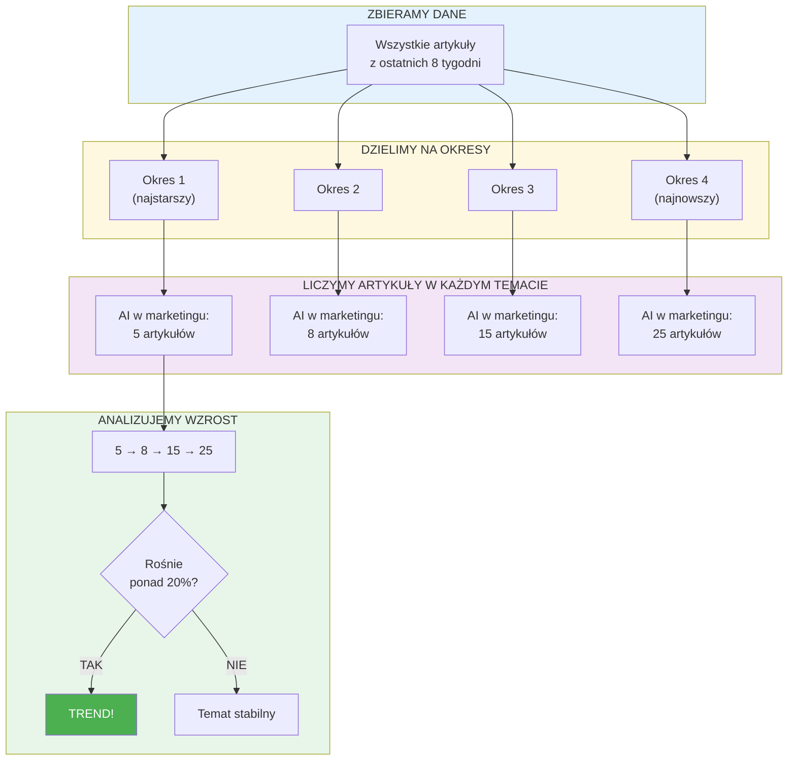
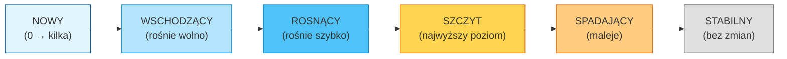
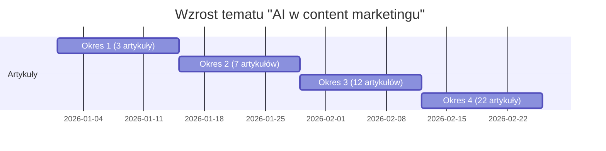

# Jak wykrywamy trendy?

## Porównanie okresów czasowych

## Etapy życia trendu

## Przykład wykrywania trendu

| Okres | Liczba artykułów | Zmiana | Status |
|-------|------------------|--------|--------|
| Styczeń 1-14 | 3 | - | Początek |
| Styczeń 15-28 | 7 | +133% | Rośnie |
| Luty 1-14 | 12 | +71% | Rośnie |
| Luty 15-28 | 22 | +83% | **TREND!** |

**Wniosek:** Temat "AI w content marketingu" jest wyraźnym trendem - liczba artykułów rośnie z okresu na okres o ponad 20%.
