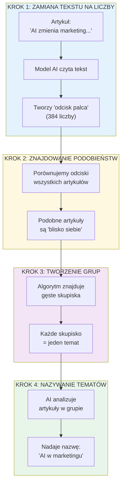
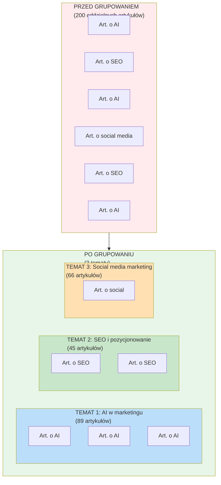
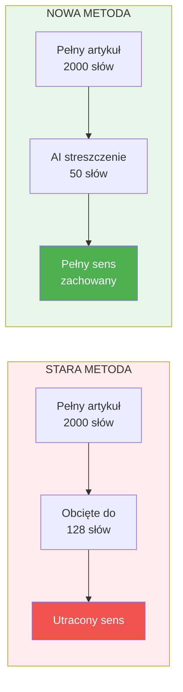

# Jak grupujemy artykuły w tematy?

## Proces krok po kroku

## Wizualizacja grupowania

## Dlaczego używamy streszczeń?

## Analogia: Biblioteka

Wyobraź sobie bibliotekę z 1000 książek rozrzuconych losowo:

| Przed grupowaniem | Po grupowaniu |
|-------------------|---------------|
| Książki leżą wszędzie | Książki na półkach tematycznych |
| Trudno znaleźć temat | Łatwo znaleźć podobne książki |
| Chaos | Porządek |

**Nasz system robi to samo z artykułami!**
