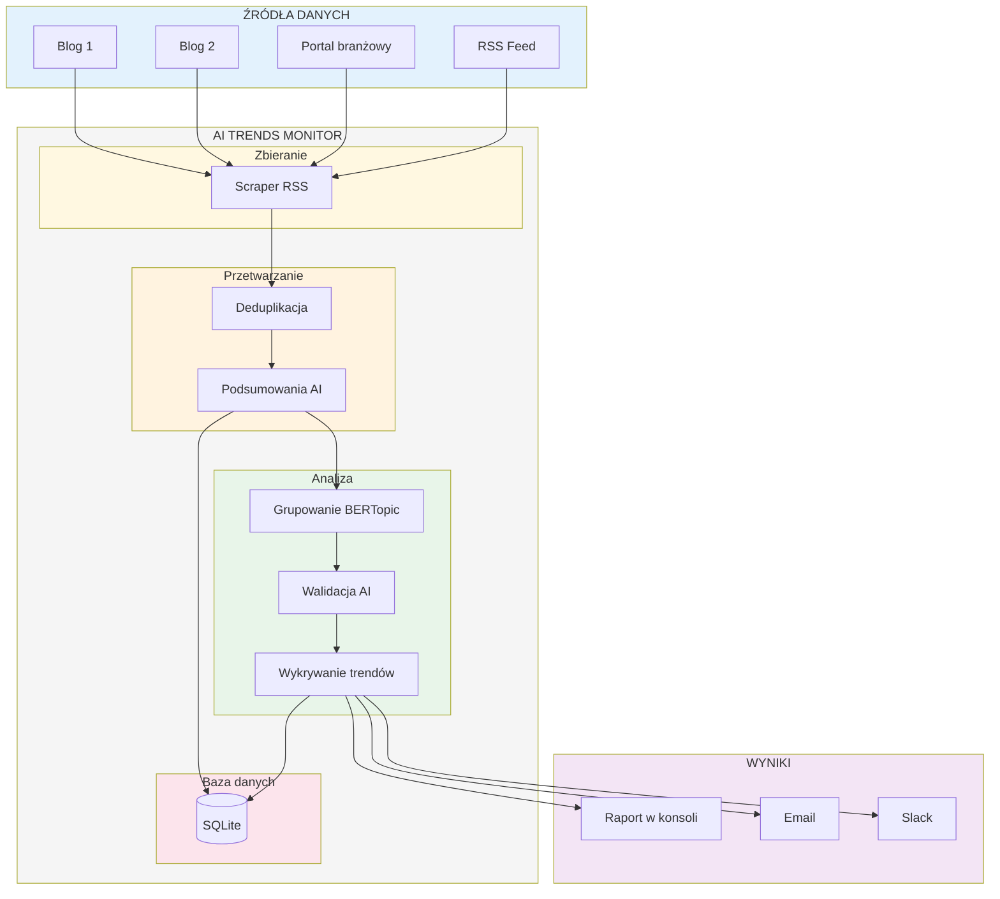
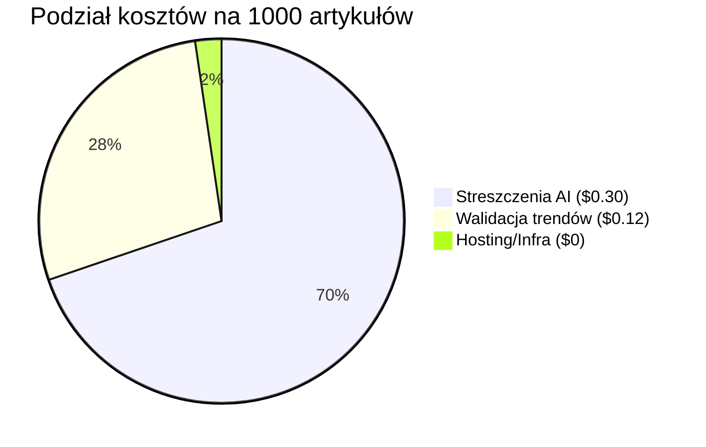
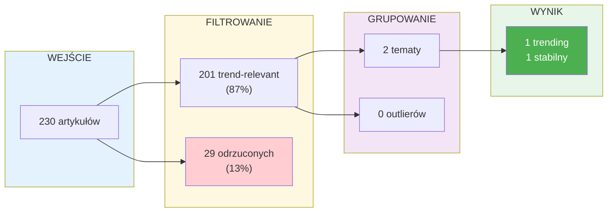

# Przegląd systemu AI Trends Monitor

## Architektura wysokopoziomowa

## Harmonogram działania

```mermaid
gantt
    title Cykl pracy systemu (co 6 godzin)
    dateFormat HH:mm
    axisFormat %H:%M

    section Zbieranie
    Pobieranie artykułów     :a1, 00:00, 5m
    Usuwanie duplikatów      :a2, after a1, 2m

    section AI Processing
    Generowanie streszczeń   :b1, after a2, 15m
    Filtrowanie nie-trendów  :b2, after a2, 15m

    section Analiza
    Grupowanie tematyczne    :c1, after b1, 3m
    Walidacja przez AI       :c2, after c1, 5m
    Wykrywanie trendów       :c3, after c2, 2m

    section Raport
    Generowanie raportu      :d1, after c3, 1m
```

## Koszty operacyjne

| Operacja | Koszt | Częstotliwość |
|----------|-------|---------------|
| Streszczenie artykułu | ~$0.0003 | Raz na artykuł |
| Walidacja tematu | ~$0.001 | Raz na temat |
| **Miesięcznie (1000 art.)** | **~$0.50** | - |

## Kluczowe metryki

