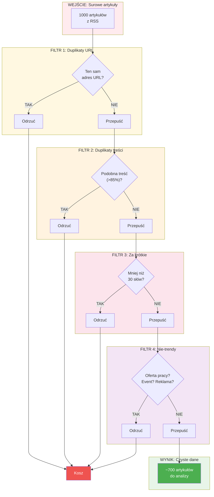
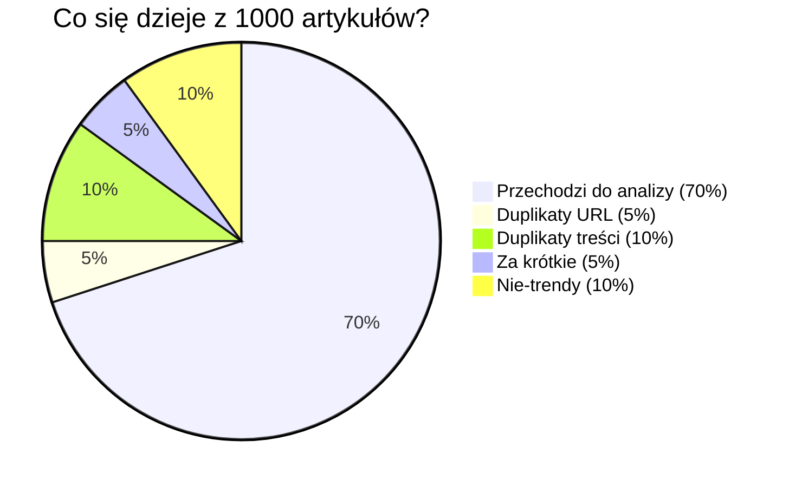
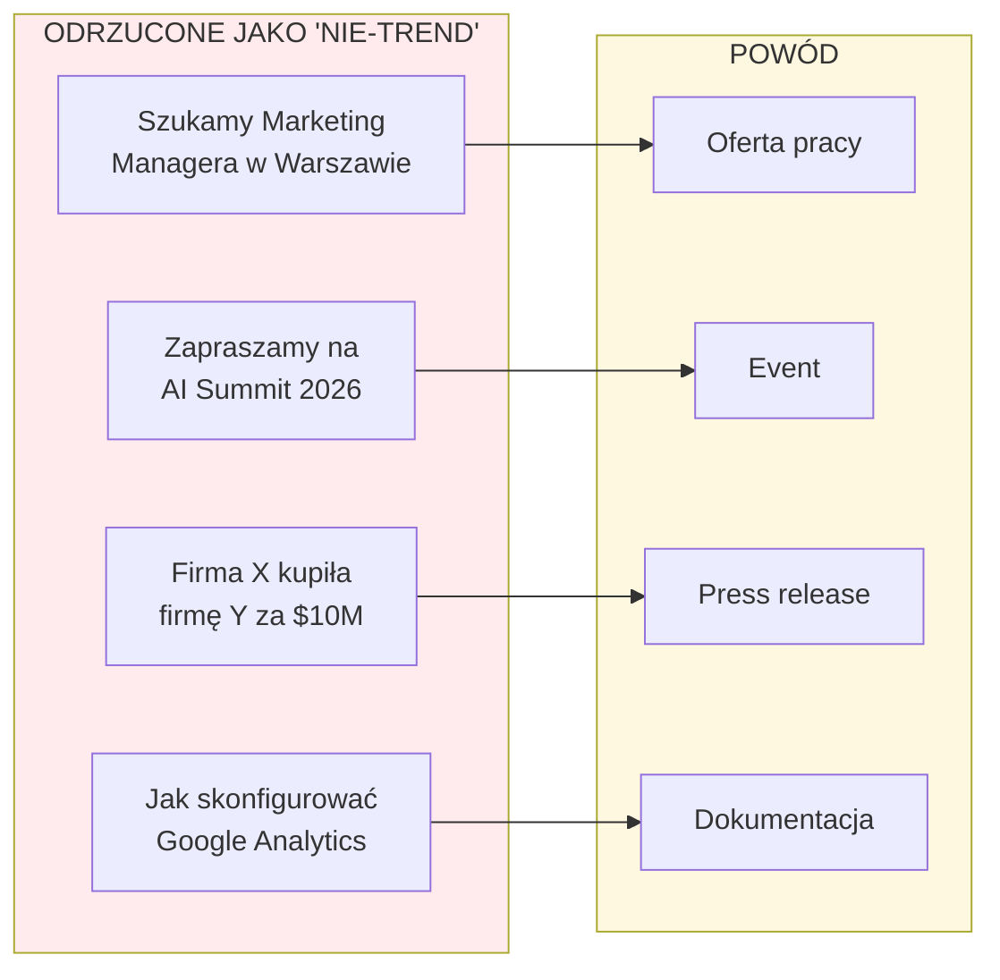
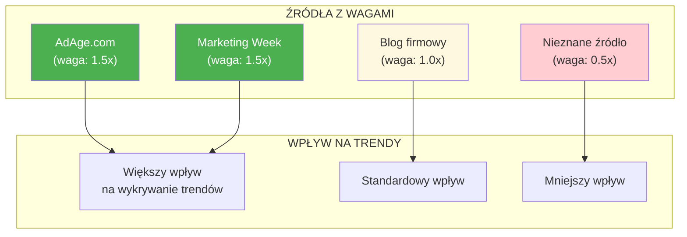

# Jakość danych - jak filtrujemy śmieci?

## Wielowarstwowe filtrowanie

## Statystyki filtrowania

## Przykłady odrzuconych artykułów

## Porównanie: Przed i po filtrach

| Metryka | Bez filtrów | Z filtrami |
|---------|-------------|------------|
| Liczba artykułów | 1000 | 700 |
| Duplikaty | 15% | 0% |
| Śmieci (oferty, eventy) | 10% | 0% |
| Jakość trendów | Niska | Wysoka |
| Czas analizy | Dłuższy | Krótszy |

## Wiarygodność źródeł

**Dlaczego wagi źródeł są ważne?**

Artykuł z AdAge.com (prestiżowy portal branżowy) powinien mieć większy wpływ na wykrywanie trendów niż artykuł z nieznanego bloga.
