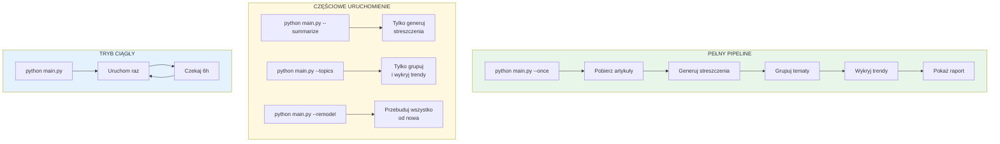
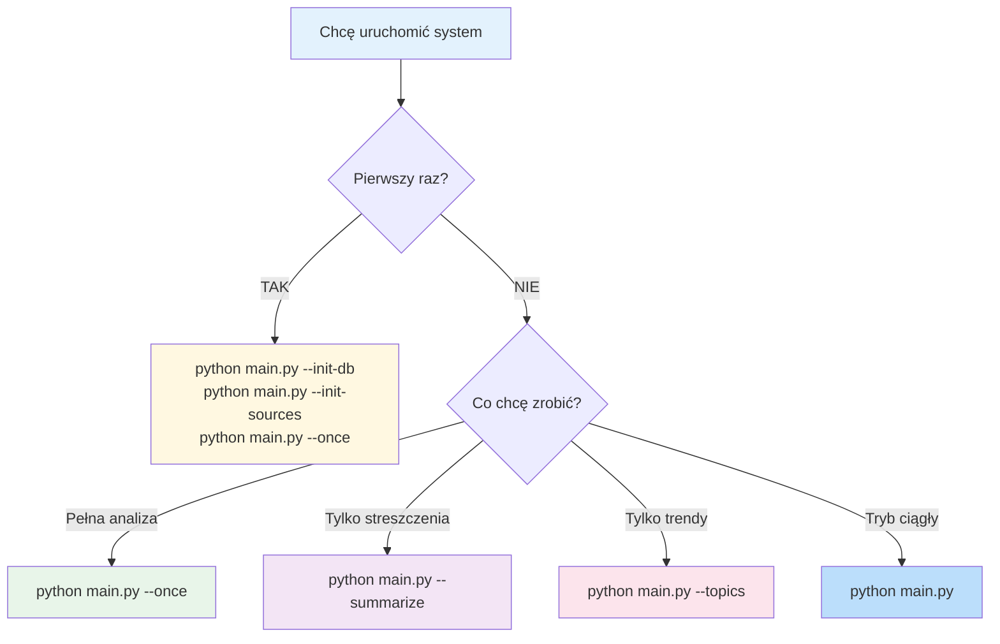
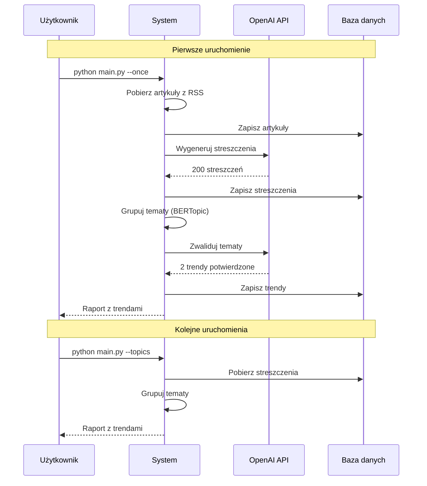

# Jak używać systemu?

## Dostępne komendy



## Kiedy użyć której komendy?



## Typowy workflow



## Przykładowe użycie

### Scenariusz 1: Codzienna analiza
```bash
# Rano - pełna analiza
python main.py --once

# Wieczorem - tylko sprawdzenie trendów (bez nowych artykułów)
python main.py --topics
```

### Scenariusz 2: Debugowanie
```bash
# Sprawdź ile artykułów ma streszczenia
sqlite3 data/trends.db "SELECT COUNT(*) FROM articles WHERE summary IS NOT NULL;"

# Wygeneruj brakujące streszczenia
python main.py --summarize

# Przebuduj klastry
python main.py --topics
```

### Scenariusz 3: Tryb produkcyjny
```bash
# Uruchom w tle (co 6 godzin)
nohup python main.py > logs/output.log 2>&1 &
```
